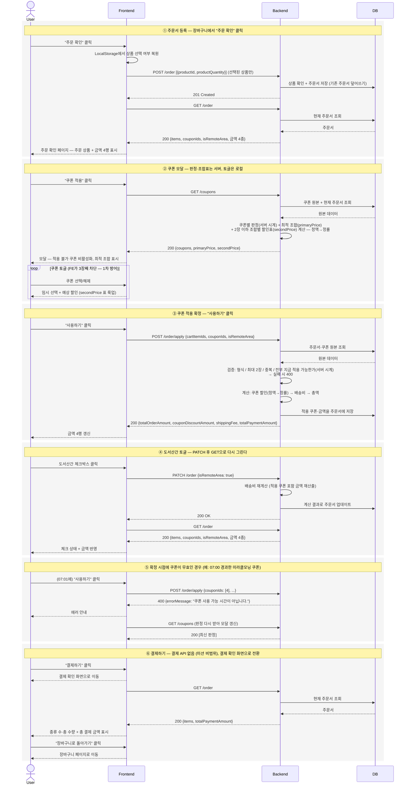

# 시스템 설계 — 쿠폰·배송비 (Step 3)

> 미션 산출물: 전체 시스템 동작의 시퀀스 다이어그램(User·Frontend·Backend·DB)과
> SSOT 설계. 쿠폰·주문서가 인메모리 DB에 저장되므로 DB를 별도 참여자로 표현하고,
> LocalStorage는 Frontend 내부 동작으로 표기한다. 요구사항 해석은 [`STEP3_REQUIREMENTS.md`](./STEP3_REQUIREMENTS.md),
> API 상세는 [`api.md`](./api.md) 참조.
>
> 아키텍처: 장바구니에서 "주문 확인"을 누르면 선택 상품을 주문서로 등록(`POST /order`)
> 하고, 쿠폰 적용과 결제 금액 계산은 `POST /order/apply`가 담당한다. apply의 결과
> (적용 쿠폰·도서산간·금액)는 주문서에 저장되며, 화면을 그리는 원천은 항상 `GET /order`다.

---

## 1. 설계 원칙 — SSOT를 어디에 둘 것인가

스펙의 제약: "쿠폰을 적용하고, 결제 금액을 확인하는 과정에서 클라이언트가 임의로 계산하지
않도록 설계한다."

구현 방식: 금액이 결정되는 값(쿠폰 판정·할인액·금액 4종)은 전부 서버가 계산해 응답한다.
Frontend는 식별자와 플래그(`cartItemIds`, `couponIds`, `isRemoteArea`)만 보내고 금액은
받기만 한다. 요청에 가격·금액을 싣지 않는다 — 클라이언트가 보낸 금액은 결국 서버가
검증해야 할 입력이 되므로, 처음부터 받지 않고 DB 원본을 조회한다.

### 상태 책임표

| 상태 | SSOT (원천) | Frontend 역할 | Backend 역할 |
| --- | --- | --- | --- |
| 상품 정보·가격 | DB | 표시 | 조회 제공 |
| 장바구니 (수량) | DB | 표시 + 수량 변경 요청 (step 2) | `GET/PATCH/DELETE /cart` |
| 상품 선택 여부 | LocalStorage (클라 상태) | 소유·지속 (step 2 `useSelection`) | 모름 — 주문서 등록 시 항목으로 변환되어 전달 |
| 주문서 (항목·적용 쿠폰·도서산간·금액) | DB (서버) | 표시 + 갱신 요청 | `POST /order`가 생성, `POST /order/apply`·`PATCH /order`가 갱신 |
| 쿠폰 원본 4종 | DB (하드코딩 시드) | 표시 | `GET /coupons`의 재료 |
| 모달 임시 선택 | FE 컴포넌트 로컬 | "사용하기"로 apply 요청, 닫으면 폐기 | 모름 |
| 쿠폰별 적용 가능 여부 (`applicable`) | BE 계산 응답 | 표시 전용 (비활성화 처리) | 현재 주문서 + 서버 시계로 판정 |
| 최적 조합 (`primaryPrice`) | BE 계산 응답 | 표시 + 적용 트리거 (apply 호출) | 적용 가능 조합 전수 평가로 산출 |
| 조합별 할인표 (`secondPrice`) | BE 계산 응답 | 토글 중 예상 할인 룩업 (클라 계산 없음) | 2장 이하 조합 전부의 할인액 계산 |
| 금액 4종 (주문·할인·배송비·총액) | BE 계산 응답 | 표시 전용 — FE는 이 값을 만들지 않는다 | apply·PATCH 때마다 재계산해 주문서에 저장 |
| 판정 시각 (만료·시간대) | BE 시계 | 시간 판정 안 함 | 단일 기준 |

중복 원천을 피하기 위해 두 가지를 정해둔다:

- 선택 여부의 원천은 LocalStorage이고, 주문서의 항목은 "주문 확인을 누른 시점"의
  스냅샷(파생물)이다. 장바구니로 돌아가 선택을 바꾸고 다시 제출하면 주문서가
  덮어써진다 — 스냅샷은 갱신될 뿐 원천이 되지 않는다.
- 장바구니 화면(step 2)의 합계 표시는 쿠폰이 개입하지 않는 순수 파생값이라 클라 계산을
  유지한다. 금지의 경계는 "쿠폰 적용 ~ 결제 금액 확인 과정"이다(요구사항 §3.11).

---

## 2. 시퀀스 다이어그램

### 전체 흐름 — 주문 확인부터 쿠폰 적용까지

### 제주도 및 도서 산간 지역 체크박스 흐름

---

## 3. 흐름별 설명

### ① 주문서 등록 — "주문 확인"을 누르는 순간

장바구니에서 체크된 상품만 골라 `POST /order`로 등록한다. 보내는 건 상품 id와
수량뿐이고 가격은 서버가 DB에서 조회한다. 이미 주문서가 있으면 덮어쓴다 — 장바구니를
고치고 다시 제출해도 이전 주문서가 남지 않는다. 등록 직후 `GET /order`로 주문서를 받아
주문 확인 페이지를 그린다. 진입이든 새로고침이든 화면의 원천은 항상 `GET /order`다.
`location.state`에 의존하지 않으므로 F5에도 깨지지 않는다.

### ② 모달 — 판정과 조합표는 서버가, 토글은 로컬에서

"쿠폰 적용"을 누르면 `GET /coupons`를 부른다. 응답은 세 부분이다: ① 쿠폰마다
적용 가능 여부(`applicable` — 만료·시간대·최소금액·BOGO 수량을 서버 시계로 판정),
② 가장 할인이 큰 조합(`primaryPrice` — 스펙: "가장 할인 효과가 큰 조합이 먼저 계산되어서
적용되어야 한다"), ③ 2장 이하 조합 전부의 할인표(`secondPrice`). 토글하는 동안은 서버를
부르지 않는다 — 예상 할인은 ③에서 찾아 읽는다. 정률 쿠폰의 할인액은 동반 쿠폰에 따라
달라지므로(정액 먼저, 정률은 할인된 금액에 — 요구사항 §3.1) 쿠폰별 할인액을 더하면 값이
틀리고, 클라가 할인식을 직접 실행하면 금지된 계산에 해당한다. 그래서 서버가 조합별로
미리 계산해둔 표를 룩업만 한다. 화면의 확정 금액 4행은 이 단계에서 바뀌지 않는다.
3장째 토글은 FE가 차단하지만 1차 방어일 뿐이고, 최종 검증은 ③ 단계의 서버가 한다.

### ③ 적용 확정 — apply는 계산하고 저장한다

"사용하기"를 누르면 `POST /order/apply`로 확정한다. 서버는 이 시점에 다시 검증한다
(최대 2장 → 중복 없음 → 전부 지금 적용 가능한가). 모달을 연 뒤 시간이 지나 판정이
달라졌을 수 있기 때문이다. 통과하면 정액→정률 순서로 할인을 계산하고 배송비·총액까지
산출한 뒤 결과를 주문서에 저장하고 금액 4종을 응답한다. 저장하므로 새로고침해도
`GET /order`가 같은 금액을 준다 — apply는 미리보기가 아니라 확정 동작이다.

### ④ 도서산간 — PATCH로 바꾸고 GET으로 다시 그린다

체크박스를 누르면 `PATCH /order { isRemoteArea }`로 상태만 바꾼다. 서버는 배송비를
재계산해(주문 금액 10만 원 이상이면 도서산간 추가비 포함 전액 무료 — 요구사항 §3.2)
주문서를 업데이트하고, FE는 `GET /order`로 갱신된 주문서를 받아 다시 그린다. 변경 요청은
PATCH가, 화면 갱신은 GET이 담당한다.

### ⑤ 확정 시점에 무효가 된 쿠폰

06:55에 골라둔 시간제 쿠폰을 07:01에 확정하면 서버가 400으로 거절한다. FE는 에러를
보여주고, `GET /coupons`로 판정을 다시 받아 모달을 갱신한다. 만료·시간대 판정의 기준은
항상 서버 시계다(요구사항 §3.10).

### ⑥ 결제하기 — 화면 전환까지만

결제 API는 미션 비범위라 "결제하기"는 결제 확인 화면으로의 전환이다. 이 화면도
`location.state` 없이 `GET /order`로 그린다. 표시하는 총 결제 금액은 서버
`totalPaymentAmount`이고, 종류 수·총 수량 세기는 금액 계산이 아닌 표시용 집계라 클라가
해도 된다(요구사항 §3.11). "장바구니로 돌아가기"로 복귀한다.

### 요약

주문서는 서버가 들고, 프론트는 식별자와 플래그만 보낸다. 금액은 전부 서버가 계산해
응답하고(apply가 확정·저장), 화면은 언제나 `GET /order`로 다시 그린다.

---

## 4. 핵심 설계 결정과 근거

| 결정 | 대안 | 근거 |
| --- | --- | --- |
| 등록(`POST /order`)과 적용(`POST /order/apply`)을 분리 | 주문서 단일 자원에 PATCH로 쿠폰 적용 | 팀 합의 명세. "장바구니 제출"과 "쿠폰 적용·금액 확정"이 별개의 행위로 드러나고, apply 응답이 금액 4종만 담아 계약이 단순하다 |
| `POST /order/apply`는 계산 결과를 주문서에 저장 | 무상태 계산(미리보기)만 | 저장하지 않으면 새로고침 시 적용 상태가 사라지고, 도서산간 PATCH 후 재계산(④)도 불가능하다 — 서버가 적용 쿠폰을 알아야 한다. `GET /order`가 쿠폰 할인을 응답하는 것 자체가 저장을 전제한다 |
| `POST /order`는 단일 "현재 주문서"를 덮어쓰기 | orderId 발급 + `/orders/:id` | 로그인 없는 단일 사용자 미션 — 주문서는 동시에 하나만 의미가 있다. 덮어쓰기가 스냅샷 신선도 문제(장바구니 수정 후 재제출)를 자동 해결. 다중 사용자 확장 시 `/orders/:id`로 전환 |
| 선택 여부의 원천은 LocalStorage, 주문서 항목은 스냅샷 | 주문서를 선택의 원천으로 승격 | 장바구니 화면은 제출 전에도 선택을 다뤄야 함(step 2). 원천 하나(LocalStorage) + 파생 스냅샷(주문서)으로 선언하면 SSOT 유지 |
| 최적 조합은 서버가 계산(`primaryPrice`), 적용 트리거는 FE | 주문서 생성 시 서버가 자동 적용 | 팀 합의 명세 — `GET /coupons`가 최적 조합을 동봉하고 FE가 apply로 확정한다. 스펙의 "먼저 계산되어서"는 primaryPrice 산출이 담당하고, 적용 시점은 사용자 흐름에 맡긴다 |
| 조합 산출 = 2장 이하 조합 전수 평가 (정액→정률 고정 순서) | 개별 할인액 상위 2개 합산 | 정률 쿠폰의 할인액이 동반 정액 쿠폰에 따라 달라져(스펙: 할인된 금액에 정률 적용) 개별 합산이 무효. 조합이 최대 10개라 전수 평가가 가장 단순하고 검증하기 쉽다 |
| 모달 토글은 로컬, 예상 할인은 `secondPrice` 룩업 | 토글마다 서버 왕복 / 쿠폰별 할인액 클라 합산 | 토글 왕복은 로딩·경쟁 상태를 만들고, 클라 합산은 정률 상호작용 때문에 부정확한 데다 식을 실행하면 금지된 계산이다. 조합표(≤10개) 룩업은 클라 계산이 없다. 확정 금액은 apply 응답만 사용 |
| 도서산간 변경은 PATCH 후 GET으로 재조회 | PATCH 응답에 갱신 주문서 동봉 | 팀 합의 명세(다이어그램) — 변경 요청(PATCH)과 화면 갱신(GET)의 분리. 왕복이 1회 늘지만 응답 계약이 단순해지고, "화면의 원천은 GET /order" 원칙이 모든 흐름에서 동일하게 유지된다 |

---

## 5. 명세 확인 필요 — 이 문서가 가정한 것들

아래는 [`api.md`](./api.md)에 아직 명시되지 않았거나 모호해서, 이 문서가 임의로 가정한
지점이다. 팀 확정 후 어긋나면 이 문서와 api.md를 함께 고친다.

1. `/order/apply`의 `cartItemIds` — `POST /order`는 `productId`로 등록하는데 apply는
   `cartItemIds`를 받는다. 이 문서는 "주문서에 등록된 항목과 일치해야 하며, 검증·계산의
   기준은 서버의 주문서"로 가정했다.
2. `isRemoteArea`의 원천 — apply 요청과 `PATCH /order` 두 경로로 들어온다. 이 문서는
   "주문서 저장값이 원천이고, 두 API 모두 그 값을 갱신한다"로 가정했다.
3. `GET /order`의 items에 상품명·이미지가 없다 (`productId`·`productPrice`·
   `productQuantity`뿐) — 주문 확인 화면에 상품명을 그리려면 필드 추가 또는 FE의 상품
   목록 조인이 필요하다.
4. 주문서가 없을 때 `GET /order` — 404로 가정 (FE는 장바구니로 돌려보낸다). 명세에는
   200/500만 있다.
5. `applicable: false`의 사유(reason) 필드가 없다 — 모달의 비활성화 안내 문구(만료/
   시간대/최소금액)를 그리려면 필요하다.
6. percentage·freeShipping 쿠폰의 필드 정의가 없다 — 예시가 fixed·bogo 두 종뿐.
   미라클모닝 쿠폰의 `availableTime` 같은 필드 계약이 비어 있다.
7. `minimumAccount` — `minimumAmount`의 오타로 보이나 명세 표기를 따랐다.
8. 에러 응답 body 형식 — `{ "errorMessage": "..." }`로 가정 (step 2 관례).
